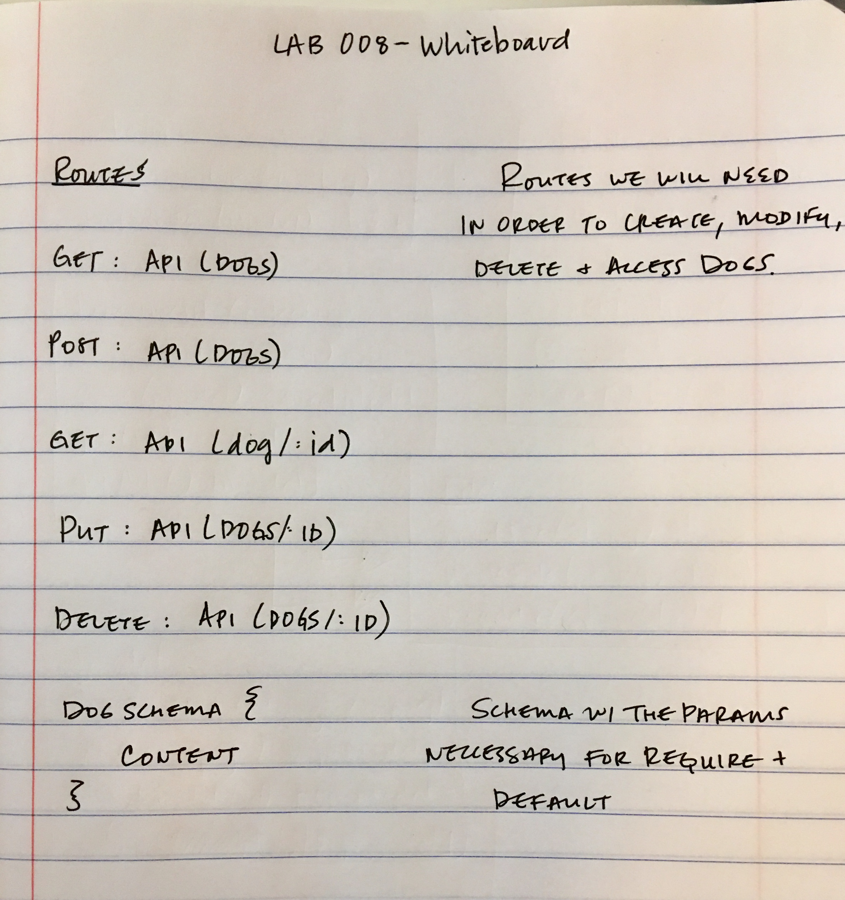

# LAB - 008

## Express

### Author: Angela Vawser

### Links and Resources
* [submission PR](https://github.com/angela-vawser-401/lab-008/pull/1)
* [travis](https://travis-ci.com/angela-vawser-401/lab-008)
* [back-end](https://avawser-lab-008.herokuapp.com/)

### Basic Express
* routing
	* method based functions (`app.get`)
	* response.send and response.json
	* regex
	* order
	* parameters (route and query)
		* request
	* `app.use()`
* static files
* project structure
	* don't use one huge app.js file!
	* views, routes, static
	* express generator- food for thought
	* `express.Router()`

### Middleware
* Parameters
* Route handling
  * Regex and efficiency
  * Router object
* Middleware error handling

### Setup
#### `.env` requirements
* `MONGODB_URI` - mongodb://localhost:27017/dogs
* `PORT` - 3000

#### Running the app
* `npm start`
* `npm start:watch`

#### Tests
* Unit Tests: `npm test`
* Lint Tests: `npm run lint`

#### UML

